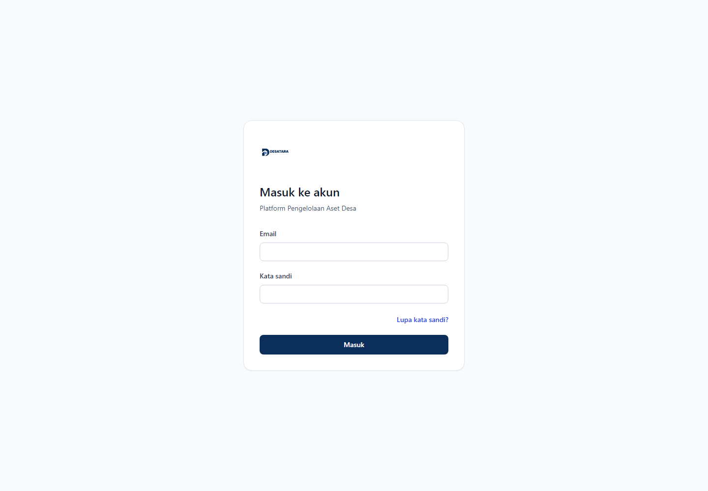

# DESATARA

**Platform Pengelolaan Aset Desa**



DESATARA adalah platform open-source untuk membantu Pemerintah Desa mengelola aset secara terstruktur, dapat ditelusuri, dan sadar regulasi. Fokusnya bukan sekadar daftar barang, tetapi tenant isolation, historical integrity, evidence, kewenangan, workflow, pelaporan, dan auditability.

> **Status:** baseline implementasi B00-B25 telah terintegrasi ke `main`. B26 Excel Import & Legacy Data Migration telah selesai secara lokal dan sedang dalam proses integrasi. B17 production-readiness tetap fail-closed sampai seluruh evidence environment production terpenuhi.

## Kenapa DESATARA?

Pengelolaan aset desa membutuhkan lebih dari CRUD: siapa yang berwenang, bukti apa yang mendukung tindakan, bagaimana riwayat dipertahankan, dan bagaimana keputusan dapat diaudit. DESATARA dibangun dengan prinsip **deny by default**, evidence private by default, permission terpisah dari regulatory authority, serta traceability dari regulasi sampai test.

## Yang Sudah Bisa Dicoba

- Laravel 13 + Inertia.js + Vue 3 + Tailwind CSS + PostgreSQL.
- Login/logout berbasis session, throttling, forgot/reset password.
- Multi-desa dengan active-tenant context dan tenant isolation.
- Master data, register aset, lifecycle, inventarisasi, approval, reporting, audit, dashboard, dan pencarian.
- Impor aset lama melalui CSV/XLSX dengan preview, validasi, duplicate protection, dan commit terkontrol.
- PHPUnit, Pint, PHPStan/Larastan, dan Vite production build sebagai quality gate.

## Quick Start

```bash
composer install
npm ci
cp .env.example .env
php artisan key:generate
# siapkan PostgreSQL dan sesuaikan .env
php artisan migrate
npm run build
php artisan serve
```

Untuk frontend development, jalankan `npm run dev` pada terminal terpisah.

## DESATARA dan SIPADES

SIPADES adalah Sistem Pengelolaan Aset Desa yang digunakan/dilayani oleh Ditjen Bina Pemerintahan Desa Kemendagri. DESATARA **bukan SIPADES, bukan aplikasi resmi Kemendagri, dan tidak mengklaim menggantikan kewajiban penggunaan sistem, prosedur, dokumen, atau pelaporan resmi yang berlaku**.

DESATARA diposisikan sebagai platform open-source pendukung tata kelola: eksplorasi workflow yang auditable, historical integrity, evidence, tenant isolation, dan transparansi implementasi. Interoperabilitas dengan sistem pemerintah hanya akan diklaim bila tersedia integrasi resmi yang benar-benar diimplementasikan dan diverifikasi.

## Roadmap Singkat

| Batch | Scope | Status |
| --- | --- | --- |
| B00-B16 | Runtime sampai Security/Performance/Accessibility Hardening | **Selesai - local gate GREEN** |
| B17 | Production Readiness & Release | **Tooling selesai; production evidence/release gate belum lengkap** |
| B18-B25 | Product Surface Completion | **Selesai - terintegrasi ke `main`; quality gate lokal hijau** |
| B26 | Excel Import & Legacy Data Migration | **Selesai secara lokal - final verification hijau; menunggu integrasi** |

Target release tetap v1.0.0. Status B17 tidak boleh ditafsirkan sebagai production-ready sampai mandatory external evidence pada `docs/PRODUCTION-READINESS.md` terpenuhi.

## Dokumentasi

Kontrak teknis lengkap berada di [docs/](docs/). Mulai dari [Document Control](docs/DOCUMENT-CONTROL.md), lalu [Architecture](docs/ARCHITECTURE.md), [PRD](docs/PRD.md), [Security](docs/SECURITY.md), [Testing](docs/TESTING.md), dan [Implementation Plan](docs/IMPLEMENTATION_PLAN.md).

Dokumentasi authoritative berstatus **Controlled Baseline**: perubahan diperbolehkan melalui review yang eksplisit ketika ada regulasi baru, contradiction terverifikasi, atau kebutuhan implementasi yang dapat dibuktikan. Perubahan tidak boleh diam-diam melemahkan security, tenant isolation, authority, historical integrity, atau acceptance gate.

## Kontribusi

Baca [CONTRIBUTING.md](CONTRIBUTING.md) sebelum membuat perubahan. Bug dan feature request dapat menggunakan template issue. Perubahan arsitektur/security/regulatory contract harus menjelaskan dampak dan menyertakan pembaruan test/dokumentasi yang relevan.

## Lisensi

DESATARA menggunakan [MIT License](LICENSE).

**DESATARA — Platform Pengelolaan Aset Desa**
